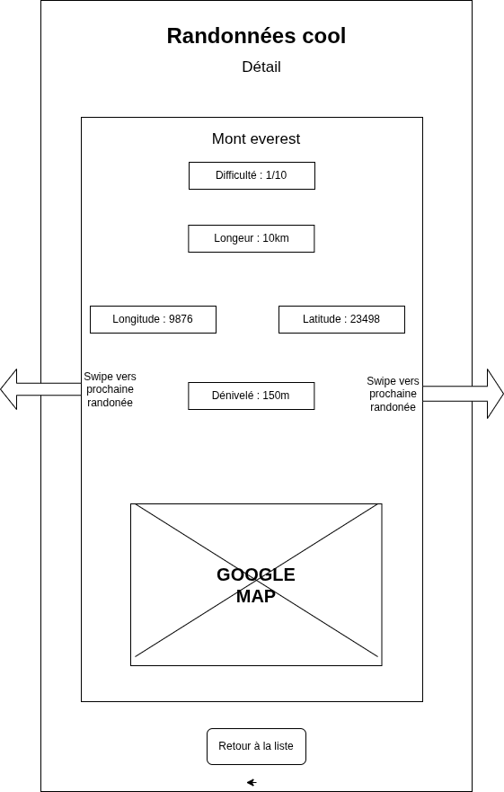
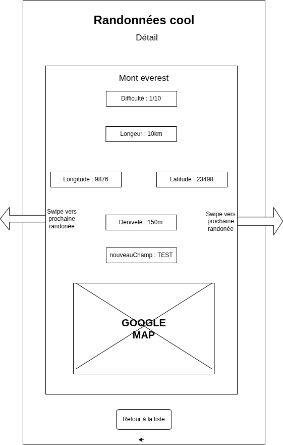

# Guide de mise à jour


### Ajout d'une nouvelle donnée dans la base de donnée

Pour l'exemple le champ s'appelle : nouveauChamp

#### Dans modèle (modele/Randonnee.js)

Ajout nouveauChamp dans le constructor : 

```
class Randonnee {
    constructor(id, .., nouveauChamp) {
        this.id = id;
        ..
        this.nouveauChamp = nouveauChamp;            <-------------- Ajout
    }
}
```

#### Dans le DAO (donnee/RandonneeDAO.js)

Ajouter un parametre, donc une valeur à la fin 

```
 initialiserDonneesParDefaut() {
        const donneesParDefaut = [
            new Randonnee(0, "Mont Everest", 10, 2, 10, 9876, 23498, 150, 2, nouveauChamp),             <-------------- Ajout
        ];
}

```

#### Dans une vue (vue/VueRandonnee)

Rajouter ceci : 

```
afficherDetails() {
        ...
        document.getElementById("randonnee-nouveauChamp").textContent = this.randonnee.nouveauChamp;              <-------------- Ajout
}

```

#### Dans une vue (vue/VueListeRandonnee)

Rajouter ceci : 

```
afficherListe(listeFiltree) {
    let listeContainer = document.getElementById("liste-randonnee-container");
    const templateCard = listeContainer.querySelector(".randonnee-card");
    const cardHTML = templateCard ? templateCard.outerHTML : "";

    let listeHTML = "";

    for (var numero in listeFiltree) {
        let cardHTMLRemplacement = cardHTML;
        cardHTMLRemplacement = cardHTMLRemplacement.replace(/\{Randonnee\.id\}/g, listeFiltree[numero].id);
        cardHTMLRemplacement = cardHTMLRemplacement.replace("{Randonnee.nom}", listeFiltree[numero].nom);
        cardHTMLRemplacement = cardHTMLRemplacement.replace("{Randonnee.difficulte}", listeFiltree[numero].difficulte + "/5");
        cardHTMLRemplacement = cardHTMLRemplacement.replace("{Randonnee.duree}", listeFiltree[numero].duree + "km");
        ...
        cardHTMLRemplacement = cardHTMLRemplacement.replace("{Randonnee.nouveauChamp}", listeFiltree[numero].nouveauChamp);                    <-------------- Ajout

        listeHTML += cardHTMLRemplacement;
    }

    listeContainer.innerHTML = listeHTML;
}
```


#### Dans le html (index.html)

```
<script type="plain/text" id="html-vue-randonnee">

    <div class="detail-grid">
        <div class="detail-item detail-difficulte" id="randonnee-difficulte"></div>
        <div class="detail-item detail-longueur" id="randonnee-longueur"></div>
        <div class="detail-item detail-longitude" id="randonnee-longitude"></div>
        <div class="detail-item detail-latitude" id="randonnee-latitude"></div>
        <div class="detail-item detail-denivele" id="randonnee-denivele"></div>
        ...
        ### ajouter ici ---->
        <div class="detail-item detail-nouveauChamp" id="randonnee-nouveauChamp"></div>         <-------------- Ajout

    </div>
                   
</script>
```

### Sur le serveur 

#### Dans RandoDAO.php 

Dans la fonction : public static function listerRandos($filtre) 
Ajouter :

```
foreach ($resultats as $row) {
    $randos[] = new Rando(
        $row->id,
        ...
        $row->nouveauChamp            <-------------- Ajout
    );
}
```
```
public static function detailRando($id)
    {
        return new Rando(
            $row->id,
            ...
            $row->nouveauChamp         <-------------- Ajout
        );
    }
```

#### Dans le modele (Rando.php)

Ajouter : 

```
private int $nouveauChamp;           <-------------- Ajout
```

```
public static $filtres = [
    'id' => FILTER_VALIDATE_INT,
    ...
    'nouveauChamp' => FILTER_SANITIZE_FULL_SPECIAL_CHARS               <-------------- Ajout
];
```

```
public function __construct(
    int $id = 0,
    ...
    float $nouveauChamp = ""                      <-------------- Ajout
)
```

```
$data = [
    'id' => $id,
    ... 
    'nouveauChamp' => $nouveauChamp                 <-------------- Ajout

        ];
        
        $filtered = filter_var_array($data, self::$filtres);
        
        $this->id = ($filtered['id'] !== false && $filtered['id'] !== null) ? $filtered['id'] : 0;
        ...
        $this->nouveauChamp = ($filtered['nouveauChamp'] !== false && $filtered['nouveauChamp'] !== null) ? $filtered['nouveauChamp'] : 0;        <------------- Ajout
     
```

Getters et setters :

```
public function getNouveauChamp(): float { return $this->nouveauChamp; } 
public function setNouveauChamp(float $nouveauChamp): void { $this->nouveauChamp = $nouveauChamp; }
```

Get xml : 

```
public function getXML(): string {
    return "<rando>
        <id>{$this->id}</id>
        ...
        <nouveauChamp>{$this->nouveauChamp}</nouveauChamp>           <------------- Ajout
    </rando>";
}
```


### Exemple fictif

Faire la requete SQL suivante pour ajouter la colonne nouveauChamo dans la table rando

```
ALTER TABLE rando
ADD COLUMN nouveauChamp TEXT DEFAULT '';
```

|  |  |
|----------------------------------------------------|---------------------------------------------------|


### Comment intégrer In-app updates dans notre App 


#### Installation du plugin Cordova pour Play Updates

```
cordova plugin add cordova-plugin-play-updates
```

Ajouter la vérification dans deviceready dans la classe Application.js :

```
document.addEventListener('deviceready', () => {
    this.initialiserNavigation();
    this.verifierMiseAJour();               <------------- Ajout
}, false);
```

Ajouter la méthode verifierMiseAJour dans la classe Application.js :

```
verifierMiseAJour() {
    // Récupère la version actuelle
    cordova.getAppVersion.getVersionNumber().then(appVersion => {

        // Google Play In-App Update
        if (cordova.platformId === "android" && window.cordova.plugins.playUpdates) {
            cordova.plugins.playUpdates.getUpdateInfo(
                updateInfo => {
                    if (updateInfo.updateAvailability === 2) { // UPDATE_AVAILABLE
                        cordova.plugins.playUpdates.startUpdate(
                            () => console.log("Update started"),
                            err => console.error("Erreur update: ", err),
                            { updateType: "IMMEDIATE" } // ou "FLEXIBLE"
                        );
                    }
                },
                err => console.error("Erreur Play Store update:", err)
            );
        } else {
            // Amazon ou autre store
            fetch("https://monserveur.com/api/version")
                .then(res => res.json())
                .then(data => {
                    if (data.latestVersion > appVersion) {
                        if (confirm("Nouvelle version disponible ! Voulez-vous télécharger depuis Amazon Appstore ?")) {
                            window.open(
                                "https://www.amazon.com/gp/mas/dl/android?p=com.monsite.monapp",
                                "_system"
                            );
                        }
                    }
                })
                .catch(err => console.error("Erreur vérification version serveur:", err));
        }
    });
}

```


